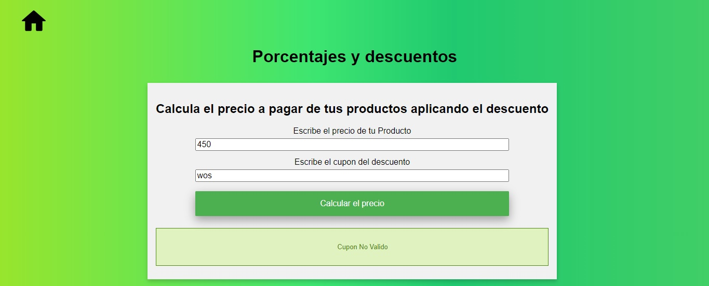

# Curso_Practico_JavasCrip

## Taller #1: Figuras Geometricas

- Primer Paso: Definir las Formulas

- Segundo paso: Implementar las formulas en JavaScrip

- Tercer Paso: Crear Funciones

- Cuarto Paso: Integrar JavaScrip con Html

   

## Taller #2: Porcentajes y descuentos

- Primer Paso: Definir las Formulas

- Segundo paso: Implementar las formulas en JavaScrip

- Tercer Paso: Crear Funciones

- Cuarto Paso: Integrar JavaScrip con Html

 
-  Primer Paso: Definir las Formulas

- Segundo paso: Implementar las formulas en JavaScrip

- Tercer Paso: Crear Funciones

- Cuarto Paso: Integrar JavaScrip con Html